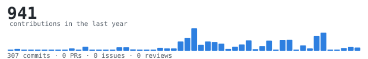

[ruthwikreddy.live](https://ruthwikreddy.live/) &nbsp;·&nbsp;

[instagram](https://www.instagram.com/ruthwwikreddy/) &nbsp;·&nbsp;

[linkedin](https://www.linkedin.com/in/ruthwwikreddy/) &nbsp;·&nbsp;

[x](https://x.com/_ruthwwikreddy_)

> Full-stack developer and high school student from Hyderabad, India. 

> Building products at the intersection of software, AI, and design.

I enjoy taking ideas from a blank canvas to production—designing,

building, deploying, and iterating. Currently focused on healthcare,

education, event technology, and developer tools.

Outside of projects, I spend time exploring real-time systems,

interactive interfaces, AI workflows, and scalable web applications.

<samp>typescript &nbsp; javascript &nbsp; python &nbsp; react &nbsp; next.js &nbsp; node.js &nbsp; firebase &nbsp; supabase &nbsp; tailwind &nbsp; git</samp>

**[MediLink](https://github.com/ruthwwikreddy/medilink)** &nbsp;·&nbsp;

<samp>React · Firebase · TypeScript</samp> 

Healthcare platform with digital medical records, emergency profiles,

and QR-powered medical identification.

**[SAT](https://github.com/ruthwwikreddy/sat)** &nbsp;·&nbsp;

<samp>React · TypeScript · AI</samp> 

AI-powered SAT preparation platform with adaptive practice,

analytics, and personalized study plans.

**[Gathrly](https://github.com/ruthwwikreddy/gathrly)** &nbsp;·&nbsp;

<samp>Next.js · Firebase · Razorpay</samp> 

Event technology platform for registrations, payments, QR check-ins,

and organizer dashboards.

**[WorkScape](https://github.com/ruthwwikreddy/WorkScape)** &nbsp;·&nbsp;

<samp>TypeScript · React</samp> 

Minimal productivity workspace built for focused task management and

daily planning.

**[Brain](https://github.com/ruthwwikreddy/brain)** &nbsp;·&nbsp;

<samp>TypeScript</samp> 

A personal knowledge base for notes, ideas, experiments, and technical

research.